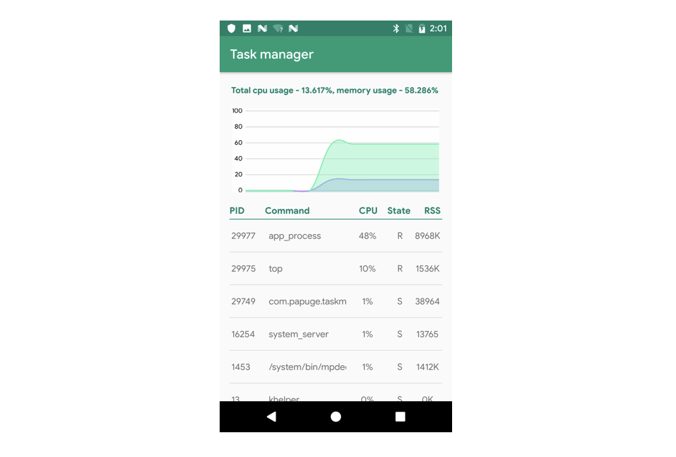

# Android-Task-Manager

*Курсовой проект по предмету "Архитектура вычислительных систем"*  

## Цели работы  
Создать мобильное приложение, в рамках которого:
* Научиться получать статистику по расходу памяти и процессора  
* Отображать общую занятость памяти и процессора
* Графически представлять процетное соотношение потребления ресурсов

## Что должно получиться  
Мобильное приложение, графически представляющее загруженность системы разными процессами.

## Что получилось
Получилось приложение, в котором есть 
* Динамическое отображение загруженности процессора и памяти в виде графиков и значений
* Получение общего времени процессора из */proc*
* Отображение всех процессов в системе при выполнении комманды `top`
* Возможность убивать процессы

### Only for <26 api  
Начиная с 26-ой версии android, чтение из /proc было запрещено, поэтому протестировать приложение можно на более ранних версиях android. 

### Rooted devices
Для доступа ко всем процессам и их ресурсам приложение было переделано для устройств с root. Данные получаются после выполнения команды `top -n 1`. 

 
